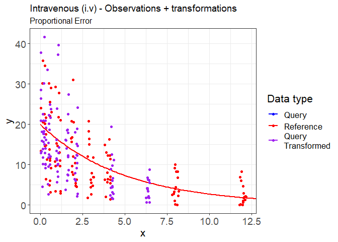
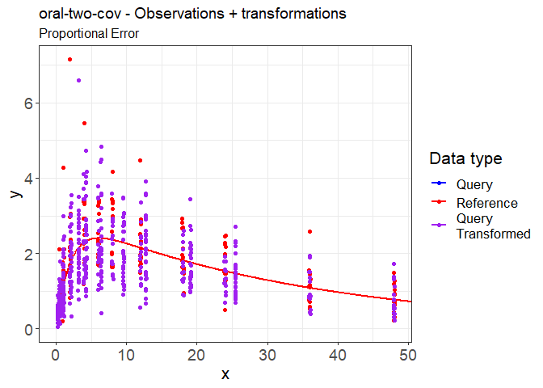
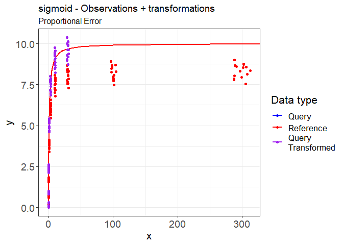
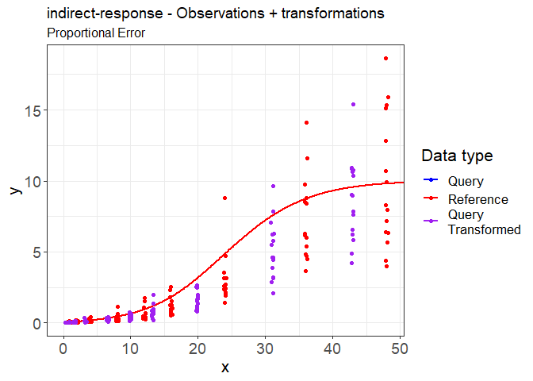
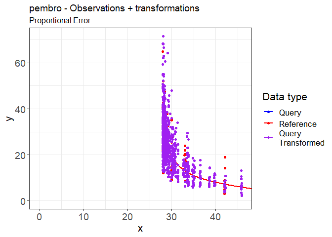

# vachette

A method for visualization of PMx models.

Vachette builds off previous work done in
[V2ACHER](https://ascpt.onlinelibrary.wiley.com/doi/10.1002/psp4.12679),
providing a method to visualize PKPD analyses which are impacted by
covariate effects.

## Installation

**Installation instructions will be available once the Github repository
has been made public**

## Examples

### IV

``` r
# Import Example Data
indivsam.obs <- read.csv(system.file(package = "vachette", "examples", "iv-obs.csv")) |> 
  dplyr::rename(WT = "vachette.cov1")
output.typ <- read.csv(system.file(package = "vachette", "examples", "iv-typ.csv")) |> 
  dplyr::rename(WT = "vachette.cov1")

library(vachette)

vd <-
  vachette_data(
    indivsam.obs,
    output.typ,
    vachette.covs = c("WT" = 70),
    ref.dose = 1,
    model.name = "Intravenous (i.v)"
  )

vd <- vd |>
  apply_transformations()

p.vachette(vd)
```

<!-- -->

### Oral Two-Cov

``` r
indivsam.obs <- read.csv(system.file(package = "vachette", "examples", "oral-two-cov-obs.csv"))
output.typ  <- read.csv(system.file(package = "vachette", "examples", "oral-two-cov-typ.csv"))

vd <-
  vachette_data(
    indivsam.obs,
    output.typ,
    vachette.covs =  c("WT" = 70, "AGE" = 30),
    ref.dose = 1,
    model.name = "oral-two-cov"
  )

vd <- vd |>
  apply_transformations(w.init = 23,
                        w1.refine = 7,
                        w2.refine = 5)

p.vachette(vd)
```

<!-- -->

### Sigmoid

``` r
indivsam.obs <- read.csv(system.file(package = "vachette", "examples", "sigmoid-obs.csv")) |>
  dplyr::rename("ID" = id)
output.typ  <- read.csv(system.file(package = "vachette", "examples", "sigmoid-typ.csv"))

vd <-
  vachette_data(
    indivsam.obs,
    output.typ,
    vachette.covs =  c("vachette.cov1" = 70),
    ref.dose = 1,
    model.name = "sigmoid"
  )

vd <- vd |>
  apply_transformations(w.init = 17,
                        w1.refine = 7,
                        w2.refine = 5)

p.vachette(vd)
```

<!-- -->

### Oral-Absorption

``` r
indivsam.obs <- read.csv(system.file(package = "vachette", "examples", "oral-absorption-obs.csv"))
output.typ  <- read.csv(system.file(package = "vachette", "examples", "oral-absorption-typ.csv"))

vd <-
  vachette_data(
    indivsam.obs,
    output.typ,
    vachette.covs =  c("vachette.cov1" = 70),
    ref.dose = 1,
    model.name = "oral-absorption"
  )

vd <- vd |>
  apply_transformations(w.init = 17,
                        w1.refine = 7,
                        w2.refine = 5)

p.vachette(vd)
```

<!-- -->

### Indirect-Response

``` r
indivsam.obs <- read.csv(system.file(package = "vachette", "examples", "indirect-response-obs.csv"))
output.typ  <- read.csv(system.file(package = "vachette", "examples", "indirect-response-typ.csv"))

vd <-
  vachette_data(
    indivsam.obs,
    output.typ,
    vachette.covs =  c("vachette.cov1" = 70),
    ref.dose = 1,
    model.name = "indirect-response"
  )

vd <- vd |>
  apply_transformations(w.init = 17,
                        w1.refine = 7,
                        w2.refine = 5)

p.vachette(vd)
```

<!-- -->

### Pembro

**Note: The Pembro data set contains a categorical covariate e.g.,
`SCHED`**

``` r
indivsam.obs <- read.csv(system.file(package = "vachette", "examples", "pembro-obs.csv"))
output.typ  <- read.csv(system.file(package = "vachette", "examples", "pembro-typ.csv"))

vd <-
  vachette_data(
    indivsam.obs,
    output.typ,
    vachette.covs =  c(SCHED = 'Q3W', ALB = 53.5),
    ref.dose = 3,
    model.name = "pembro"
  )

print(vd)
```

    ## Model Name:      pembro 
    ## Covariate Names: SCHED, ALB 
    ## Reference Values:    SCHED=Q3W , ALB=53.5

If no reference value is specified, the covariate central tendency is
used e.g., median for continuous and mode for categorical covariate.

``` r
vd <-
  vachette_data(
    indivsam.obs,
    output.typ,
    vachette.covs =  c("SCHED", "ALB"),
    ref.dose = 3,
    model.name = "pembro"
  )

print(vd)
```

    ## Model Name:      pembro 
    ## Covariate Names: SCHED, ALB 
    ## Reference Values:    SCHED=Q2W , ALB=16

``` r
vd <- vd |>
  apply_transformations(w.init = 17,
                        w1.refine = 7,
                        w2.refine = 5)
```

    ## [1] "**** EXTEND REFERENCE CURVE FOR query i.ucov 1 (Region: 1) *****"
    ## [1] "**** END EXTENSION *****"
    ## [1] "**** EXTEND REFERENCE CURVE FOR query i.ucov 2 (Region: 2) *****"
    ## [1] "**** END EXTENSION *****"
    ## [1] "**** EXTEND REFERENCE CURVE FOR query i.ucov 4 (Region: 1) *****"
    ## [1] "**** END EXTENSION *****"
    ## [1] "**** EXTEND REFERENCE CURVE FOR query i.ucov 5 (Region: 2) *****"
    ## [1] "**** END EXTENSION *****"
    ## [1] "**** EXTEND REFERENCE CURVE FOR query i.ucov 7 (Region: 1) *****"
    ## [1] "**** END EXTENSION *****"
    ## [1] "**** EXTEND REFERENCE CURVE FOR query i.ucov 9 (Region: 1) *****"
    ## [1] "**** END EXTENSION *****"

``` r
p.vachette(vd)
```

<!-- -->
