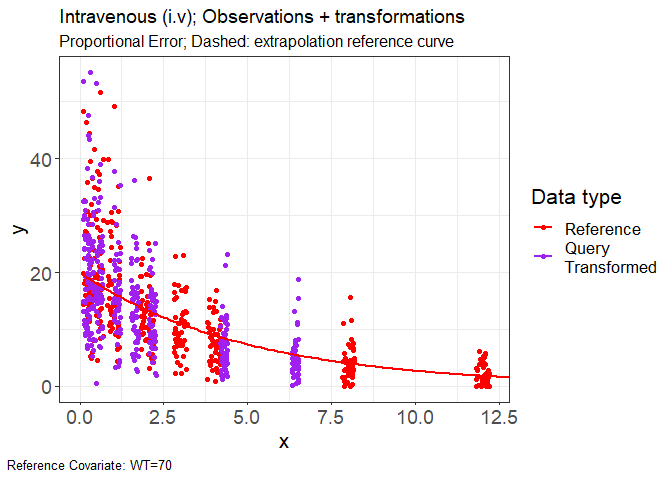

# vachette

A method for visualization of PMx models.

Vachette builds off previous work done in
[V2ACHER](https://ascpt.onlinelibrary.wiley.com/doi/10.1002/psp4.12679),
providing a method to visualize PKPD analyses which are impacted by
covariate effects.

## Installation

``` r
remotes::install_github("certara/vachette")
```

## Examples

### IV

``` r
# Import Example Data
obs.data <- read.csv(system.file(package = "vachette", "examples", "iv-obs.csv"))
typ.data <- read.csv(system.file(package = "vachette", "examples", "iv-typ.csv"))

library(vachette)

vd <-
  vachette_data(
    obs.data,
    typ.data,
    covariates = c(WT = 70),
    mappings = c(OBS = "DV",
                 x = "time"),
    ref.dosenr = 1,
    model.name = "Intravenous (i.v)"
  )
```

    ## `EVID` column found in obs.data, creating `dosenr` column in data for corresponding ref.dosenr value

    ## `EVID` column found in typ.data, creating `dosenr` column in data for corresponding ref.dosenr value

``` r
vd <- vd |>
  apply_transformations()

p.vachette(vd)
```

<!-- -->

### Oral Two-Cov

``` r
obs.data <- read.csv(system.file(package = "vachette", "examples", "oral-two-cov-obs.csv"))
typ.data  <- read.csv(system.file(package = "vachette", "examples", "oral-two-cov-typ.csv"))

vd <-
  vachette_data(
    obs.data,
    typ.data,
    covariates =  c(WT = 70, AGE = 30),
    mappings = c(OBS = "DV",
                 x = "time"),
    ref.dosenr = 1,
    model.name = "oral-two-cov"
  )
```

    ## `EVID` column found in obs.data, creating `dosenr` column in data for corresponding ref.dosenr value

    ## `EVID` column found in typ.data, creating `dosenr` column in data for corresponding ref.dosenr value

``` r
vd <- vd |>
  apply_transformations(window = 23)

p.vachette(vd)
```

<!-- -->
