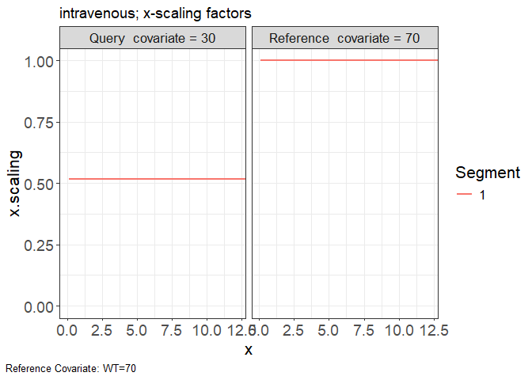

# vachette

A method to visualize pharmacometric analyses which are impacted by covariate
effects. Variability-Aligned Covariate Harmonized-Effects and
Time-Transformation Equivalent (VACHETTE) facilitates intuitive overlays
of data and model predictions, allowing for comprehensive comparison
without dilution effects. VACHETTE improves upon previous methods
[V2ACHER](https://ascpt.onlinelibrary.wiley.com/doi/10.1002/psp4.12679),
enabling its application to all pharmacometric models and enhancing
Visual Predictive Checks (VPC) by integrating data into cohesive plots
that can highlight model misspecification.

## Installation

## Development

``` r
remotes::install_github("certara/vachette")
```

## Usage

### Import Data

The minimal required inputs for vachette are two data.frame objects: the
observed (`obs.data`) and simulated predictions of typical curves
(`typ.data`).

The user also has the option to include simulated data (`sim.data`), in
order to derive transformations needed for a VACHETTE VPC. The
`sim.data` requires the same columns as `obs.data`, in addition to a
required `REP` column to indicate the replicate number.

Data files:

-   iv-obs.csv
-   iv-typ-minmax.csv

``` r
obs <- read.csv(system.file(package = "vachette", "examples", "iv-obs.csv"))
typ <- read.csv(system.file(package = "vachette", "examples", "iv-typ-minmax.csv"))
```

### Vachette Transformations

Generate transformations for `obs.data` and `sim.data`

``` r
library(vachette)

vd <-
  vachette_data(
    obs.data = obs,
    typ.data = typ,
    covariates = c(WT=70),
    mappings = c(x = "time",
                 OBS = "DV"),
    model.name  = "intravenous"
  ) |>
  apply_transformations()
```

### Vachette Plot

Generate `vachette` plots

``` r
p.obs.ref.query(vd) 
```

<!-- -->

``` r
p.vachette(vd)
```

<!-- -->

``` r
p.scaled.typical.full.curves.landmarks(vd)
```

<!-- -->

``` r
p.scaling.factor(vd)
```

<!-- -->

``` r
p.scaled.typical.curves(vd)
```

<!-- -->

``` r
p.obs.excluded(vd)
```

<!-- -->

View excluded observations

``` r
vd$obs.excluded
```

    ## # A tibble: 15 × 15
    ##      REP    ID      x   OBS dosenr    WT COV   region region.type  ucov     y
    ##    <dbl> <int>  <dbl> <dbl>  <int> <int> <chr>  <int> <chr>       <dbl> <dbl>
    ##  1     1     3 0.0743 25.9       1    30 30         1 open            1 25.9 
    ##  2     1    10 0.0920  2.26      1    30 30         1 open            1  2.26
    ##  3     1    12 0.0739 25.6       1    30 30         1 open            1 25.6 
    ##  4     1    21 0.0830 10.0       1    30 30         1 open            1 10.0 
    ##  5     1    40 0.0559  9.26      1    30 30         1 open            1  9.26
    ##  6     1    48 0.0547 18.3       1    30 30         1 open            1 18.3 
    ##  7     1    52 0.0997 16.2       1    70 70         1 open            2 16.2 
    ##  8     1    57 0.0749 11.2       1    70 70         1 open            2 11.2 
    ##  9     1    61 0.0961 36.7       1    70 70         1 open            2 36.7 
    ## 10     1    67 0.0538 11.9       1    70 70         1 open            2 11.9 
    ## 11     1    78 0.0711 11.5       1    70 70         1 open            2 11.5 
    ## 12     1    90 0.0579 15.0       1    70 70         1 open            2 15.0 
    ## 13     1    91 0.0862 45.6       1    70 70         1 open            2 45.6 
    ## 14     1    93 0.0828 49.2       1    70 70         1 open            2 49.2 
    ## 15     1    95 0.0651 27.4       1    70 70         1 open            2 27.4 
    ## # ℹ 4 more variables: ref <chr>, exclude <dbl>, PRED <dbl>, reason <chr>
