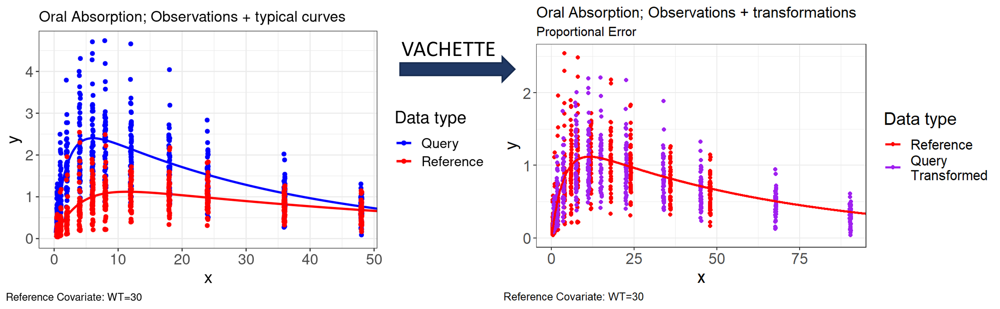

```{r setup, include=FALSE}
library(learnr)
library(vachette)
library(egg)
knitr::opts_chunk$set(echo = FALSE)
obs.data <- vachette::oral_absorption_obs
typ.data <- vachette::oral_absorption_typ
vd <- vachette_data(obs.data = obs.data,
                    typ.data = typ.data, 
                    covariates = "WT",
                    mappings = c(x = "time", OBS = "DV"),
                    model.name = "Oral Absorption")
vd <- vd |> apply_transformations()
```

## vachette


You have observations and a model and you want to know:

-   Does our proposed model describe the data adequately?
-   Do we observe different trends in different subsets of the data?
-   How well does our model fit one subset **versus** others?
-   How well does the data fit together, while accounting for underlying differences of subsets?

------------------------------------------------------------------------

The `vachette` package evolved from the v2ACHER methodology, which yields an intuitive, clear overlay of data for models with covariates:

-   Enables seeing relationship of model predictions to data with covariate effects 'removed'
-   Allows combination of all data in a single plot, without dilution effects due to stratification
-   Visualize how covariate effects 'scale' the dependent and/or independent variables
-   Shows how well the model coherently fits all observations



Additionally, the `vachette` transformed data can easily be applied for visual predictive checks (VPC). Improve confidence intervals by integrating data into a single plot, subgroup, and/or region, including other improved properties compared to traditional VPC or pcVPC to reveal model misspecification.

## How it Works


::: {style="background-color:#F1F1F1; padding: 2rem;"}
### *Prerequisites*

1.  **Model**: User-provided PMx model accounting for covariate effects in observations which were used to fit the model.

2.  **Simulate**: User simulates typical curves for all potential covariate combinations available in the observation data. Step-size of observation time points should be relatively small. Simulated time points should also extend well beyond observation time points, to where model predictions plateau or decay to a steady value.

*Given the observed data and simulated predictions of typical curves, the user should have two `data.frame` in R to begin working with vachette, see `obs.data` and `typ.data` in `?vachette_data`.*

**Required columns obs.data**

-   "ID" - Subject ID
-   "x" - Typically time
-   "PRED" - Population prediction, required if iiv.correction = TRUE
-   "IPRED" - Individual prediction, required if iiv.correction = TRUE
-   "OBS" - DV
-   "dosenr" - Dose number; unique dose number for ID/time point.

**Required columns typ.data**

-   "ID" - Subject ID
-   "x" - Typically time
-   "PRED" - Population prediction
-   "dosenr" - Dose number; unique dose number for ID/time point
:::

### *vachette*

-   Run `vachette_data() %>% apply_transformations()`
    -   vachette will automatically identify the **characteristic landmarks** which are used to split each curve into *segments*
    -   vachette transforms the data e.g., DV, TIME, to align multiple **query curves** to a single (user-defined) **reference curve**
        -   The reference curve is derived from the user specified reference covariate values and dose number.
    -   The transformations between *segments* are then applied to observations (and optionally simulated data for VPC usage).

#### Determine Landmarks for Segments

Landmark finding uses derivatives of user simulated model curves to identify maxima, minima, and inflection points; asymptote determines last segment of simulated curves.

#### Mapping Segments

Vachette transformation of typical curves segments given endpoints (x\^start, x\^end), creating scaled values for x and y in the data:

-   x-scaling: Contract or expand query segment in x-domain to match x-length of the corresponding reference segment using a constant scaling factor.
-   y-scaling: Apply linear interpolations\* using the x-scaled query information, knowing the reference segments landmark points.

*Note: y-values are scaled such that the proportional or additive distance to the query curve is preserved. See `error.model` argument in `?vachette_data`.*

#### Additional Terminology

-   **region**: Observations between dose events are given a numeric identifier, named region.
-   **region.type**: Open or closed. All final dose regions are considered open, including single dose data.
-   **segment**: The segment number determined by maxima, minima, and inflection points of simulated curves.

## Exercise: Examine required input data

Vachette provides example usage data inside the package. The two required input `data.frame` are already assigned to a variable named `obs.data` and `typ.data` below.

Use the `head()` function with our `obs.data` and `typ.data` `data.frame` to preview the data. Adjust the number of rows to display with the `n` argument.

```{r glimpse-obs-typ-data, exercise=TRUE, exercise.eval=TRUE}
obs.data <- vachette::oral_absorption_obs
typ.data <- vachette::oral_absorption_typ
```

```{r glimpse-obs-typ-data-solution}
head(obs.data, n = 100)
head(typ.data, n = 100)
```

In this simplified data example, we have a single covariate `WT` in the data with two unique values:

```{r}
unique(obs.data$WT)
```

## Exercise: Create `vachette_data()`

In this exercise we will use the `vachette_data()` function to create our `vachette_data` object.

### Usage

```{r, eval = FALSE, echo=TRUE}
vachette_data(
  obs.data,
  typ.data,
  sim.data = NULL,
  covariates,
  ref.dosenr,
  iiv.correction = FALSE,
  error.model = c("proportional", "additive"),
  model.name = NULL,
  mappings = NULL
)
```

### Arguments

-   `obs.data`: data.frame; Observed data
-   `typ.data`: data.frame; Typical (population) curves
-   `sim.data`: data.frame; Simulated (VPC) data
-   `covariates`: named character vector; Covariate names with reference values in vachette transformation
-   `ref.dosenr`: integer; Dose number to use as the reference dose, corresponding to value in "dosenr" column in input data
-   `iiv.correction`: logical; Apply inter-individual variability correction. Default FALSE
-   `error.model`: character; Applied error model, "proportional" or "additive". Default "proportional".
-   `model.name`: character; Optional model name for plot output
-   `mappings`: named character vector; Optional mappings to be included if column names in input data.frame differ from required column names. See Required Columns section:

### Excersise

Use the `vachette_data()` function and assign the return value `vd`. You will need to add the edit the `obs.data`, `typ.data`, `covariates`, and `mappings` argument in the below code.

**Note that `vachette` data inputs expects the following naming conventions defined in [Prerequisites]. If columns are named differently in the data, you must use the `mappings` argument.**

```{r vachette-data, exercise=TRUE, exercise.eval=FALSE}
vd <- vachette_data(obs.data = ,
                    typ.data = , 
                    covariates = "",
                    mappings = c(x = "", OBS = ""))
```

```{r vachette-data-solution}
vd <- vachette_data(obs.data = obs.data,
                    typ.data = typ.data, 
                    covariates = "WT",
                    mappings = c(x = "time", OBS = "DV"))
```


## Exercise: Use `apply_transformation()`

### Excersise

Use the `apply_transformations()` function with the `vd` variable you created in the previous exercise.

After running `apply_transformations()`, inspect the newly created `data.frame` `vd$obs.all` with the `head()` function.

```{r apply-transformations, exercise=TRUE, exercise.eval=TRUE}

```

```{r apply-transformations-solution}
vd <- vd |> apply_transformations()

head(vd$obs.all, n = 100)
```

## Exercise: Generate `vachette` plots

Use the `p.obs.ref.query()` and `p.vachette()` plotting functions and compare plots.

### Exercise

Plot the original data points and model curves with the `vd` object using the function `p.obs.ref.query()`.

```{r p-obs-ref-query, exercise=TRUE, exercise.eval=FALSE}
```

```{r p-obs-ref-query-solution}
p.obs.ref.query(vd)
```

Create the `vachette`-transformed plot with the `vd` object using the function `p.vachette()`.

```{r p-vachette, exercise=TRUE, exercise.eval=FALSE}
```

```{r p-vachette-solution}
p.vachette(vd)
```

## Exercise: Run `vachette` using simulated data

## Exercise: Create `vachette`-transformed VPC

### Quiz

*You can include any number of single or multiple choice questions as a quiz. Use the `question` function to define a question and the `quiz` function for grouping multiple questions together.*

Some questions to verify that you understand the purposes of various base and recommended R packages:

```{r quiz}
quiz(
  question("Which package contains functions for installing other R packages?",
    answer("base"),
    answer("tools"),
    answer("utils", correct = TRUE),
    answer("codetools")
  ),
  question("Which of the R packages listed below are used to create plots?",
    answer("lattice", correct = TRUE),
    answer("tools"),
    answer("stats"),
    answer("grid", correct = TRUE)
  )
)
```
