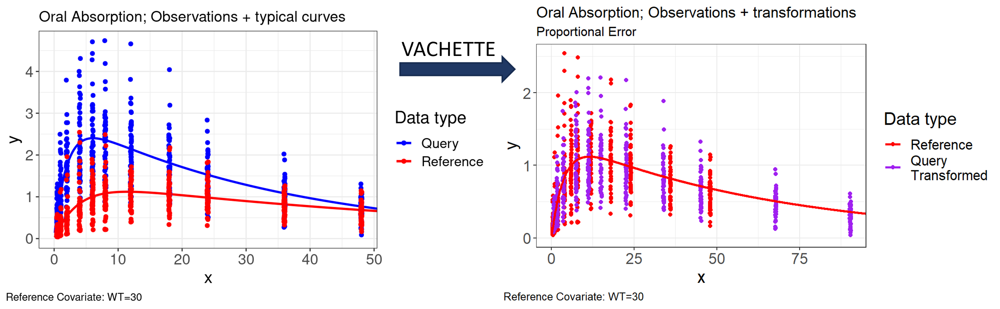

<a href="https://certara.github.io/vachette" target="_blank" class="github-corner" aria-label="View source on GitHub"><svg width="80" height="80" viewBox="0 0 250 250" style="fill:#151513; color:#fff; position: absolute; top: 0; border: 0; right: 0;" aria-hidden="true"><path d="M0,0 L115,115 L130,115 L142,142 L250,250 L250,0 Z"></path><path d="M128.3,109.0 C113.8,99.7 119.0,89.6 119.0,89.6 C122.0,82.7 120.5,78.6 120.5,78.6 C119.2,72.0 123.4,76.3 123.4,76.3 C127.3,80.9 125.5,87.3 125.5,87.3 C122.9,97.6 130.6,101.9 134.4,103.2" fill="currentColor" style="transform-origin: 130px 106px;" class="octo-arm"></path><path d="M115.0,115.0 C114.9,115.1 118.7,116.5 119.8,115.4 L133.7,101.6 C136.9,99.2 139.9,98.4 142.2,98.6 C133.8,88.0 127.5,74.4 143.8,58.0 C148.5,53.4 154.0,51.2 159.7,51.0 C160.3,49.4 163.2,43.6 171.4,40.1 C171.4,40.1 176.1,42.5 178.8,56.2 C183.1,58.6 187.2,61.8 190.9,65.4 C194.5,69.0 197.7,73.2 200.1,77.6 C213.8,80.2 216.3,84.9 216.3,84.9 C212.7,93.1 206.9,96.0 205.4,96.6 C205.1,102.4 203.0,107.8 198.3,112.5 C181.9,128.9 168.3,122.5 157.7,114.1 C157.9,116.9 156.7,120.9 152.7,124.9 L141.0,136.5 C139.8,137.7 141.6,141.9 141.8,141.8 Z" fill="currentColor" class="octo-body"></path></svg></a>

```{r setup, include=FALSE}
knitr::opts_chunk$set(echo = FALSE)

library(learnr)
library(vachette)
library(ggplot2)
library(egg)
library(dplyr)
library(tidyvpc)
tutorial_options(exercise.timelimit = 180)

part_1_ppt <- paste0("./images/vachette/vachette_", 1:9, ".png")
part_2_ppt <- paste0("./images/how_it_works/how_it_works_", 1:18, ".png")
part_3_ppt <- paste0("./images/exercises_6/exercise_", 1:40, ".png")
part_4_ppt <- paste0("./images/vpc/vpc_", 1:17, ".png")

obs.data <- vachette::oral_absorption_obs
typ.data <- vachette::oral_absorption_typ
sim.data <- vachette::oral_absorption_sim

vd <- vachette_data(obs.data = obs.data,
                    typ.data = typ.data,
                    sim.data = sim.data,
                    covariates = c(WT = 70),
                    mappings = c(x = "time", OBS = "DV"),
                    model.name = "Oral Absorption")
vd <- vd |> apply_transformations()

obs_trans <- readRDS("./data/obs_trans.Rds")
sim_trans <- readRDS("./data/sim_trans.Rds")

```

## vachette


You have observations and a model and you want to know:

-   Does our proposed model describe the data adequately?
-   Do we observe different trends in different subsets of the data?
-   How well does our model fit one subset **versus** others?
-   How well does the data fit together, while accounting for underlying differences of subsets?

------------------------------------------------------------------------

A new methodology for variability-aligned covariate harmonized-effects and time-transformation equivalent (VACHETTE) is made accessible within the `vachette` R package.

The `vachette` R package is a visualization tool that yields an intuitive, clear overlay of data for models with covariates.

-   Enables seeing relationship of model predictions to data with covariate effects 'removed'
-   Allows combination of all observed data in a single plot, without dilution effects due to stratification
-   Visualize how covariate effects 'scale' the dependent and/or independent variables
-   Shows how well the model coherently fits all observations

VACHETTE improves the previously developed [V<sup>2</sup>ACHER method](https://www.ncbi.nlm.nih.gov/pmc/articles/PMC8452296/) by enabling application to all types of pharmacometric models. 



<br>

Additionally, visual predictive checks (VPC) can easily be applied on the `vachette` transformed data (VACHETTE VPC). A VACHETTE VPC, compared to a traditional VPC or pcVPC, may improve confidence intervals by integrating data into a single plot, subgroup, and/or reveal model misspecification.

------------------------------------------------------------------------

##### Published example of application of the transformation method for an Exposure-Response model with multiple covariate effects


### Additional Slides

<div id="part1Slides" class="carousel slide" data-ride="carousel" data-interval="false">
  <!-- Indicators -->
  <ol class="carousel-indicators">
```{r echo=FALSE, results='asis'}
for (i in 1:length(part_1_ppt)) {
  cat(ifelse(i == 1, '<li data-target="#part1Slides" data-slide-to="0" class="active"></li>\n', 
              paste0('<li data-target="#part1Slides" data-slide-to="', i-1, '"></li>\n')))
}
```
  </ol>
  <!-- Wrapper for slides -->
  <div class="carousel-inner">
```{r echo=FALSE, results='asis'}
for (i in 1:length(part_1_ppt)) {
  cat(ifelse(i == 1, 
             paste0('<div class="item active"></div>\n'),
             paste0('<div class="item"></div>\n')))
}
```
  </div>
  <!-- Left and right controls -->
<a class="left carousel-control" href="#part1Slides" role="button" data-slide="prev">
  <span class="glyphicon glyphicon-chevron-left"></span>
  <span class="sr-only">Previous</span>
</a>
<a class="right carousel-control" href="#part1Slides" role="button" data-slide="next">
  <span class="glyphicon glyphicon-chevron-right"></span>
  <span class="sr-only">Next</span>
</a>
</div>


## How it Works {#how_it_works}


::: {style="background-color:#F1F1F1; padding: 2rem;"}
### *Prerequisites* {#prerequisites}

1.  **Model**: User-provided PMx model accounting for covariate effects in observations which were used to fit the model.

2.  **Simulate**: User simulates typical curves for all potential covariate combinations available in the observation data. Step-size of observation time points should be relatively small. Simulated time points should also extend well beyond observation time points, to where model predictions plateau or decay to a steady value.

*The minimal required inputs for `vachette` are two `data.frame` objects: the observed (`obs.data`) and simulated predictions of typical curves (`typ.data`).*

*The user also has the option to include simulated data (`sim.data`), in order to derive transformations needed for a VACHETTE VPC. The `sim.data` `data.frame` has the same required columns as `obs.data`, in addition to a required `REP` column to indidcate the replicate number. *

**Required columns obs.data**

-   "ID" - Subject ID
-   "x" - Typically time
-   "PRED" - Population prediction, required if iiv.correction = TRUE
-   "IPRED" - Individual prediction, required if iiv.correction = TRUE
-   "OBS" - DV
-   "dosenr" - Dose number; unique number of associated dosing event for ID/time point.

**Required columns typ.data**

-   "ID" - Subject ID
-   "x" - Typically time
-   "PRED" - Population prediction
-   "dosenr" - Dose number; unique dose number for ID/time point

**Required columns sim.data (Optional)** 

-   "REP" - Replicate number
-   "ID" - Subject ID
-   "x" - Typically time
-   "PRED" - Population prediction, required if iiv.correction = TRUE
-   "IPRED" - Individual prediction, required if iiv.correction = TRUE
-   "OBS" - DV
-   "dosenr" - Dose number; unique number of associated dosing event for ID/time point.

Additionally, you should have at least one covariate column accounted for in the above input data, which should be specified in the `covariates` argument of `vachette_data()`.

If missing `dosenr`, `vachette` will attempt to calculate the corresponding dose number for a given row using `ADDL`, `II`, and/or `EVID`, as applicable.

*Note: If column names in your input data are different than those defined above, you may use the `mappings` argument in `vachette_data()` to map column names to expected values.*
:::

### *vachette*

-   Run `vd <- vachette_data() ` to create the `vachette_data` object
-   Run `vd <- vd %>% apply_transformations()`
    -   `vachette` will automatically identify the **characteristic landmarks** which are used to split each curve into *segments*
    -   `vachette` transforms the data e.g., DV, TIME, to align multiple **query curves** to a single (user-defined) **reference curve**
        -   The reference curve is derived from the user specified reference covariate values, dose, and dosing event (`dosenr`)
    -   The transformations between every *segment* are then applied to observations (and optionally simulated data for VPC usage) according to the segment each observation belongs to

#### Determine Landmarks for Segments

Landmarks are characteristic points to split a curve into segments. Landmarks are identified for the simulated model and include maxima, minima, inflection points and asymptotes to determine the end of the last segment of a curve.

#### Mapping Segments

Vachette transformation of typical curves segments given endpoints (x\^start, x\^end), creating scaled values for x and y in the data:

-   x-scaling: Contract or expand query segment in x-domain to match x-length of the corresponding reference segment using a constant scaling factor.
-   y-scaling: Apply linear interpolations using the x-scaled query information, knowing the reference segments landmark points.

*Note: y-values are scaled such that the proportional or additive distance to the query curve is preserved. See `error.model` argument in `?vachette_data`.*

#### Terminology

-   **region**: Observations between dose events are given a numeric identifier, named region.
-   **region.type**: Open or closed. All last dose regions are considered open, including single dose data.
-   **segment**: The segment number determined by maxima, minima, inflection points, and last point associated with an asymptote of simulated curves.
-   **reference**: Typical curve and observations of a (reference) population selected by the user.
    -   "Population" means a particular set of covariate values, such as sex of female and weight of 30 kg.
-   **query**: All other curves and observations.
    -   `vachette` will transform these to what the user's model suggests they would have been if they came from the reference population, enabling us to "see the data the way the model does."

### Additional Slides

<div id="part2Slides" class="carousel slide" data-ride="carousel" data-interval="false">
  <!-- Indicators -->
  <ol class="carousel-indicators">
```{r echo=FALSE, results='asis'}
for (i in 1:length(part_2_ppt)) {
  cat(ifelse(i == 1, '<li data-target="#part2Slides" data-slide-to="0" class="active"></li>\n', 
              paste0('<li data-target="#part2Slides" data-slide-to="', i-1, '"></li>\n')))
}
```
  </ol>
  <!-- Wrapper for slides -->
  <div class="carousel-inner">
```{r echo=FALSE, results='asis'}
for (i in 1:length(part_2_ppt)) {
  cat(ifelse(i == 1, 
             paste0('<div class="item active"></div>\n'),
             paste0('<div class="item"></div>\n')))
}
```
  </div>
  <!-- Left and right controls -->
<a class="left carousel-control" href="#part2Slides" role="button" data-slide="prev">
  <span class="glyphicon glyphicon-chevron-left"></span>
  <span class="sr-only">Previous</span>
</a>
<a class="right carousel-control" href="#part2Slides" role="button" data-slide="next">
  <span class="glyphicon glyphicon-chevron-right"></span>
  <span class="sr-only">Next</span>
</a>
</div>


## Exercise: Examine required input data

Vachette provides example usage data inside the package. We will be exploring a single dose oral absorption model. The two required input `data.frame` objects are already assigned to a variable named `obs.data` and `typ.data` below.


### Exercise 

Use the `head()` function with our `obs.data` and `typ.data` `data.frame` to preview the data. Adjust the number of rows to display with the `n` argument.

```{r glimpse-obs-typ-data, exercise=TRUE, exercise.eval=FALSE}
obs.data <- vachette::oral_absorption_obs
typ.data <- vachette::oral_absorption_typ
```

```{r glimpse-obs-typ-data-solution}
head(obs.data, n = 10)
head(typ.data, n = 10)
```


In this simplified data example, we have a single covariate `WT` in the data with two unique values:

```{r, echo=TRUE}
unique(obs.data$WT)
```

We can plot the concentration vs time profile of the observed data using `ggplot2`:

### Exercise

In the code below, replace the text `COV` inside the `facet_wrap()` function with the name of the covariate column in the data e.g., `WT`.

```{r, plot-obs-data, exercise=TRUE, exercise.eval=FALSE}
obs.data %>%
  mutate(ID = as.factor(ID)) %>%
  ggplot(aes(x = time, y = DV, group = ID)) +
  facet_wrap(~ COV, labeller = as_labeller(function(value) paste("Weight:", value))) +
  geom_line() +
  geom_point()
```

```{r, plot-obs-data-solution}
obs.data %>%
  mutate(ID = as.factor(ID)) %>%
  ggplot(aes(x = time, y = DV, group = ID)) +
  facet_wrap(~ WT, labeller = as_labeller(function(value) paste("Weight:", value))) +
  geom_line() +
  geom_point()
```

## Exercise: Create `vachette_data()`

In this exercise we will use the `vachette_data()` function to create our `vachette_data` object.

### Usage

```{r, eval = FALSE, echo=TRUE}
vachette_data(
  obs.data,
  typ.data,
  sim.data = NULL,
  covariates,
  ref.dosenr,
  iiv.correction = FALSE,
  error.model = c("proportional", "additive"),
  model.name = NULL,
  mappings = NULL
)
```

### Arguments

-   `obs.data`: data.frame; Observed data
-   `typ.data`: data.frame; Typical (population) curves
-   `sim.data`: data.frame; Simulated (VPC) data
-   `covariates`: named character vector; Covariate names with reference values in vachette transformation
-   `ref.dosenr`: integer; Dose number to use as the reference dose, corresponding to value in "dosenr" column in input data
-   `iiv.correction`: logical; Apply inter-individual variability correction. Default FALSE
-   `error.model`: character; Applied error model, "proportional" or "additive". Default "proportional".
-   `model.name`: character; Optional model name for plot output
-   `mappings`: named character vector; Optional mappings to be included if column names in input data.frame differ from required column names. See 'Required Columns' in section [How it Works](#how_it_works).

### Exercise

Use the `vachette_data()` function and assign the return value `vd`. You will need to edit the `obs.data`, `typ.data`, `covariates`, and `mappings` argument in the below code.

**Note that `vachette` data input expects the following naming conventions defined in [Prerequisites](#prerequisites). If columns are named differently in the data, you must use the `mappings` argument.**

```{r vachette-data, exercise=TRUE, exercise.eval=FALSE}
vd <- vachette_data(obs.data = ,
                    typ.data = , 
                    covariates = "",
                    mappings = c(x = "", OBS = ""))
print(vd)
```

```{r vachette-data-solution}
vd <- vachette_data(obs.data = obs.data,
                    typ.data = typ.data, 
                    covariates = "WT",
                    mappings = c(x = "time", OBS = "DV"))

print(vd)
```

Covariates are initialized in `vachette` using the `covariates` argument, which should specify one or more covariate column names in your input data as a character vector e.g., `covariates = c("WT", "SEX")`

You may also specify both the covariate and reference value to use as a named vector e.g., `covariates = c(WT = 70, SEX = "male")`

If a covariate reference value is not given e.g., `covariates = c("WT", "SEX")`, `vachette` will use the median (for continuous covariates) and mode (for categorical covariates) as the reference value, by default.

In the below exercise, try explicitly setting the reference value of the `WT` covariate column to `70` in the `covariates` argument.

Lastly, use the `model.name` argument to supply a descriptive model name e.g., `"Oral Absorption"`.

```{r vachette-data2, exercise=TRUE, exercise.eval=FALSE}
vd <- vachette_data(obs.data = obs.data,
                    typ.data = typ.data, 
                    covariates = c(WT = ),
                    mappings = c(x = "time", OBS = "DV"),
                    model.name = )
print(vd)
```

```{r vachette-data2-solution}
vd <- vachette_data(obs.data = obs.data,
                    typ.data = typ.data, 
                    covariates = c(WT = 70),
                    mappings = c(x = "time", OBS = "DV"),
                    model.name = "Oral Absorption")

print(vd)
```

## Exercise: Use `apply_transformation()`

### Excersise

Use the `apply_transformations()` function with the `vd` variable you created in the previous exercise.

After running `apply_transformations()`, inspect a subset of columns within the newly created `data.frame` `vd$obs.all` using the `select()` and `head()` / `tail()` functions.


```{r apply-transformations, exercise=TRUE, exercise.eval=FALSE}
vd <- vd %>% 

head(vd$obs.all %>% select(ID,WT,ref,seg,x,x.scaled,OBS,y.scaled), n=10)
tail(vd$obs.all %>% select(ID,WT,ref,seg,x,x.scaled,OBS,y.scaled), n=10)
```

```{r apply-transformations-solution}
vd <- vd %>% apply_transformations()

head(vd$obs.all %>% select(ID,WT,ref,seg,x,x.scaled,OBS,y.scaled), n=10)
tail(vd$obs.all %>% select(ID,WT,ref,seg,x,x.scaled,OBS,y.scaled), n=10)
```

Note the most relevant columns are x.scaled and y.scaled, as these determine the positions of the `vachette`-transformed data points.

## Exercise: Generate `vachette` plots

Use the `p.obs.ref.query()` and `p.vachette()` plotting functions and compare plots.

### Exercise

Plot the original data points and model curves with the `vd` object using the function `p.obs.ref.query()`.

```{r p-obs-ref-query, exercise=TRUE, exercise.eval=FALSE}
```

```{r p-obs-ref-query-solution}
p.obs.ref.query(vd)
```

Create the `vachette`-transformed plot with the `vd` object using the function `p.vachette()`.

```{r p-vachette, exercise=TRUE, exercise.eval=FALSE}
```

```{r p-vachette-solution}
p.vachette(vd)
```

### Exercise

Use the `p.vachette.arrow()` function to visualize the directionality of transformations.

```{r p-arrow, exercise=TRUE, exercise.eval=FALSE}
```

```{r p-arrow-solution}
p.vachette.arrow(vd)
```

Below you can find an overview of available `vachette` plotting functions. Feel free to explore!

```{r p-additional-functions, exercise=TRUE, exercise.eval=FALSE}
p.scaled.typical.curves.landmarks(vd) 
```


### Additional Slides

<div id="part3Slides" class="carousel slide" data-ride="carousel" data-interval="false">
  <!-- Indicators -->
  <ol class="carousel-indicators">
```{r echo=FALSE, results='asis'}
for (i in 1:length(part_3_ppt)) {
  cat(ifelse(i == 1, '<li data-target="#part3Slides" data-slide-to="0" class="active"></li>\n', 
              paste0('<li data-target="#part3Slides" data-slide-to="', i-1, '"></li>\n')))
}
```
  </ol>
  <!-- Wrapper for slides -->
  <div class="carousel-inner">
```{r echo=FALSE, results='asis'}
for (i in 1:length(part_3_ppt)) {
  cat(ifelse(i == 1, 
             paste0('<div class="item active"></div>\n'),
             paste0('<div class="item"></div>\n')))
}
```
  </div>
  <!-- Left and right controls -->
<a class="left carousel-control" href="#part3Slides" role="button" data-slide="prev">
  <span class="glyphicon glyphicon-chevron-left"></span>
  <span class="sr-only">Previous</span>
</a>
<a class="right carousel-control" href="#part3Slides" role="button" data-slide="next">
  <span class="glyphicon glyphicon-chevron-right"></span>
  <span class="sr-only">Next</span>
</a>
</div>

## Exercise: Run `vachette` using simulated data and create VPC

In the previous examples, we ran `vachette_data()` using only the observed data e.g., `obs.data`. We can also supply a simulated dataset to the `vachette_data()` function, in order to derive a `vachette` transformed VPC.

For this exercise, we will again be using the oral absorption model. The `obs.data` and `typ.data` `data.frame` objects have been assigned as in the previous exercises and the new `sim.data` `data.frame` object has been additionally assigned.

```{r, echo = TRUE, eval = FALSE}
obs.data <- vachette::oral_absorption_obs
typ.data <- vachette::oral_absorption_typ
sim.data <- vachette::oral_absorption_sim
```

### Exercise

Use the `sim.data` argument to specify the `sim.data` input `data.frame` in the `vachette_data()` function.  We will also 'pipe' in the next `apply_transformations()` function using the `%>%` or `|>` operator.

```{r vachette-data-sim, exercise=TRUE, exercise.eval=FALSE}
vd <- vachette_data(obs.data = obs.data,
                    typ.data = typ.data,
                    sim.data = ,
                    covariates = c(WT = 70),
                    mappings = c(x = 'time', OBS = 'DV'),   
                    model.name = 'Oral Absorption')     %>%
  apply_transformations()

p.vachette(vd)
```

```{r vachette-data-sim-solution}
vd <- vachette_data(obs.data = obs.data,
                    typ.data = typ.data,
                    sim.data = sim.data ,
                    covariates = c(WT = 70),
                    mappings = c(x = 'time', OBS = 'DV'),   
                    model.name = 'Oral Absorption')     %>%
  apply_transformations()

p.vachette(vd)
```

Next, we will extract the observed and simulated `vachette`-transformed `data.frame` from the `vd` object, and use them to create our VPC via the `tidyvpc` package.  

```{r extract-trans, exercise=TRUE, exercise.eval=TRUE}
obs_trans <- vd$obs.all
sim_trans <- vd$sim.all
```


#### Generate traditional VPC, pcVPC and `vachette` transformed VPC

In this exercise, we will use the `obs_trans` and `sim_trans` `data.frame` to generate various VPC's with the [`tidyvpc`](https://certara.github.io/tidyvpc/) package.

First we will generate a VPC and pcVPC with the original data, then compare with our VPC we generate using our `vachette`-transformed data.

Add `obs_trans` to the first argument in the `observed()` function and `sim_trans` to the first argument in the `simulated()` function. 

```{r vachette-vpc1, exercise=TRUE, exercise.eval=FALSE}
vpc <- observed( , x = x, y = y) |>
  simulated( , x = x, y = y) |>
  binning(bin = "pam", nbins = 11) |>
  vpcstats()

pcvpc <- observed(obs_trans, x = x, y = y) |>
  simulated(sim_trans, x = x, y = y) |>
  binning(bin = "pam", nbins = 11) |>
  predcorrect(pred = PRED) |>
  vpcstats()

plot(vpc) + labs(title = "Traditional VPC")
plot(pcvpc) + labs(title = "Prediction-corrected VPC")
```

```{r vachette-vpc1-solution}
vpc <- observed(obs_trans, x = x, y = y) |>
  simulated(sim_trans, x = x, y = y) |>
  binning(bin = "pam", nbins = 11) |>
  vpcstats()

pcvpc <- observed(obs_trans, x = x, y = y) |>
  simulated(sim_trans, x = x, y = y) |>
  binning(bin = "pam", nbins = 11) |>
  predcorrect(pred = PRED) |>
  vpcstats()

plot(vpc) + labs(title = "Traditional VPC")
plot(pcvpc) + labs(title = "Prediction-corrected VPC")
```

--- 

Now it's time to generate a `vachette`-transformed VPC!  

For the previous `vpc` and `pcvpc`, we used the original `x` and `y` columns in our data e.g., time and DV. Instead, we will now use the `x.scaled` and `y.scaled` columns.

In the `observed()` and `simulated()` functions, supply `x.scaled` and `y.scaled` to the `x` and `y` arguments. Lastly, `plot()` the `vpc_vachette` object.

```{r vachette-vpc3, exercise=TRUE, exercise.eval=FALSE}
vpc_vachette <- observed(obs_trans, x = , y = ) |>
  simulated(sim_trans, x = , y = ) |>
  binning(bin = "pam", nbins = 18) |>
  vpcstats()

plot() + labs(title = "vachette VPC , scaled to reference body weight of 70 kg")
```

```{r vachette-vpc3-solution}
vpc_vachette <- observed(obs_trans, x = x.scaled, y = y.scaled ) |>
  simulated(sim_trans, x = x.scaled , y = y.scaled) |>
  binning(bin = "pam", nbins = 18) |>
  vpcstats()

plot(vpc_vachette) + labs(title = "vachette VPC , scaled to reference body weight of 70 kg")
```

VPC and pcVPC mix observations across the different covariate values. Comparing VPC’s, we can see that the `vachette`-transformed VPC is more easily interpretable – all data points and curves now correspond to the selected reference of 70 kg body weight group.

In addition to the VPC exercise result, here is an example illustrating how `vachette` collapses different dosing regimens and single and multiple dose data into an integrated VPC view after the second dose.


More examples of vachette VPC can be found in the additional slides below. More  details on the example shown above are included from slide 12 onwards. 


### Additional Slides

<div id="part4Slides" class="carousel slide" data-ride="carousel" data-interval="false">
  <!-- Indicators -->
  <ol class="carousel-indicators">
```{r echo=FALSE, results='asis'}
for (i in 1:length(part_4_ppt)) {
  cat(ifelse(i == 1, '<li data-target="#part4Slides" data-slide-to="0" class="active"></li>\n', 
              paste0('<li data-target="#part4Slides" data-slide-to="', i-1, '"></li>\n')))
}
```
  </ol>
  <!-- Wrapper for slides -->
  <div class="carousel-inner">
```{r echo=FALSE, results='asis'}
for (i in 1:length(part_4_ppt)) {
  cat(ifelse(i == 1, 
             paste0('<div class="item active"></div>\n'),
             paste0('<div class="item"></div>\n')))
}
```
  </div>
  <!-- Left and right controls -->
<a class="left carousel-control" href="#part4Slides" role="button" data-slide="prev">
  <span class="glyphicon glyphicon-chevron-left"></span>
  <span class="sr-only">Previous</span>
</a>
<a class="right carousel-control" href="#part4Slides" role="button" data-slide="next">
  <span class="glyphicon glyphicon-chevron-right"></span>
  <span class="sr-only">Next</span>
</a>
</div>

## Recap, Tips, and Tricks


### Tips and Tricks for Troubleshooting:

* Do not forget to **simulate out long enough** that the curve visually does not change anymore and is very close to the asymptote.

* `vachette` works best when the simulation uses constant spacing between values of the independent value (e.g., a **'regular grid'** in time, concentration, or other 'x-value').

* If you want to carry out a transformation for a curve which should be analyzed (and plotted) using a log-x scale, the simulation should be on regularly spaced values for log(x) rather than regularly spaced values of x. For example, when modeling sigmoidal relationships.

... and stay tuned for new `vachette` developments! 


* Drop requirement to simulate out for (much) longer than the last observation.

* Improve performance using any (simulated) x-grid.

---


## Quiz

```{r quiz}
quiz(
  question("What is the purpose of applying VACHETTE transformation?",
    answer("Replacing all traditional PMx diagnostic plots"),
    answer("Summarize covariate model to improve communication of PMx results", correct = TRUE),
    answer("Bring all observed data into one plot"),
    answer("Show most important covariate combination of a PMx model")
  ),
  question("In which direction may observations change their positions during scaling?",
    answer("Vertically in both directions, and horizontally towards higher values"),
    answer("Vertically in both directions, and horizontally towards lower values"),
    answer("Vertically and horizontally in both directions", correct = TRUE),
    answer("Vertically and horizontally lower values")
  ),
    question("Which function is used to do the actual VACHETTE transformation?",
    answer("vachette_data()"),
    answer("apply_transformations()", correct = TRUE),
    answer("get.x.multi.landmarks()"),
    answer("p.vachette()")
  ),
    question("Which argument inside vachette_data() is used to create the vachette_data object using non-standard column names?",
    answer("mappings", correct = TRUE),
    answer("ref.dosenr"),
    answer("covariates"),
    answer("iiv.correction")
  ),
    question("What are the landmarks and why they are useful?",
    answer("Landmarks tell you where vachette is in the transformation process"),
    answer("Landmarks indicate the type of data the user reads from file"),
    answer("Landmarks provide warnings if certain transformation steps fail"),
    answer("Landmarks are characteristic points on a curve used for transformation purposes", correct = TRUE)
  )
)
```

<script>
$(document).ready(function() {
  $("#section-part1Slides .carousel-control").on('click', function(e) {
    e.preventDefault();
    if ($(this).data('slide') === 'prev') {
      $('#section-part1Slides').carousel('prev');
    } else {
      $('#section-part1Slides').carousel('next');
    }
  });
});
</script>

<script>
$(document).ready(function() {
  $("#section-part2Slides .carousel-control").on('click', function(e) {
    e.preventDefault();
    if ($(this).data('slide') === 'prev') {
      $('#section-part2Slides').carousel('prev');
    } else {
      $('#section-part2Slides').carousel('next');
    }
  });
});
</script>

<script>
$(document).ready(function() {
  $("#section-part3Slides .carousel-control").on('click', function(e) {
    e.preventDefault();
    if ($(this).data('slide') === 'prev') {
      $('#section-part3Slides').carousel('prev');
    } else {
      $('#section-part3Slides').carousel('next');
    }
  });
});
</script>

<script>
$(document).ready(function() {
  $("#section-part4Slides .carousel-control").on('click', function(e) {
    e.preventDefault();
    if ($(this).data('slide') === 'prev') {
      $('#section-part4Slides').carousel('prev');
    } else {
      $('#section-part4Slides').carousel('next');
    }
  });
});
</script>
